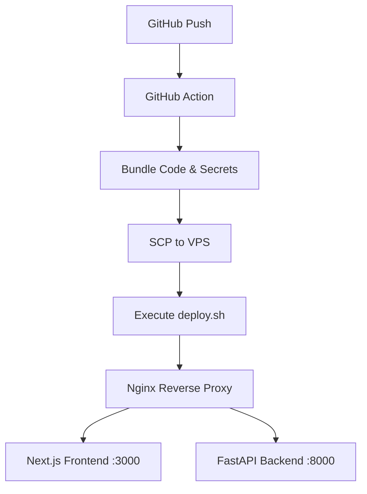

# Tulz - Deployment Walkthrough

This document explains the end-to-end deployment process for **Tulz** onto your VPS (`38.242.208.42`).

## 🏗️ Architecture Overview

Both the frontend and backend are hosted on the same VPS, managed by **Nginx** and **Systemd**.



---

## 🚀 The Deployment Flow

### 1. GitHub Actions (`.github/workflows/deploy.yml`)
When you push to the `main` branch:
- **Build Artifact**: It packs `backend/`, `frontend/`, and necessary deploy scripts into a `tar.gz`.
- **Secrets Injection**: It reads your GitHub Secrets and creates temporary `.env` files for production.
- **Transfer**: It uses `scp` to upload the bundle and environment files to `/tmp` on your VPS.
- **Trigger**: It runs `ssh sudo /tmp/deploy.sh` to start the on-server update.

### 2. VPS Update Script (`deploy/deploy.sh`)
The script runs with `sudo` on your server and performs these steps:
- **Prerequisites**: If it's a new server, it installs Python 3.12, Node.js 22, Nginx, and PostgreSQL.
- **Extraction**: Moves the new code to `/opt/toolhub`.
- **Backend**: Update the virtual environment and runs database migrations (`alembic`).
- **Frontend**: Runs `npm install` and `npm run build`.
- **Services**:
    - **Backend**: Managed via `toolhub-api.service` (using Gunicorn + Uvicorn).
    - **Frontend**: Managed via `toolhub-web.service` (running `next start`).
- **Nginx**: Configures a single server block for `tulz.tools` that routes `/api` to the backend and everything else to the frontend.

---

## 🛠️ Required GitHub Secrets

You must add these in your repository settings:

| Name | Note |
| :--- | :--- |
| `VPS_HOST` | `38.242.208.42` |
| `VPS_USER` | `root` |
| `SSH_PRIVATE_KEY` | Your private SSH key (must correspond to public key on VPS) |
| `SECRET_KEY` | A long, random string (e.g., 64 characters) for backend security. |
| `ENV_BACKEND` | Complete content for `.env` (e.g., `DATABASE_URL`, `ADMIN_EMAIL`, etc.) |
| `ENV_FRONTEND` | `NEXT_PUBLIC_API_URL=https://tulz.tools`, `NEXT_PUBLIC_GA_MEASUREMENT_ID`, AdSense IDs, etc. |

> [!IMPORTANT]
> **Production Boot Failure**: If you see a **502 Bad Gateway**, the backend likely failed to start because:
> 1. `SECRET_KEY` is missing in `ENV_BACKEND`.
> 2. `SECRET_KEY` is shorter than 32 characters.
> 
> Generate a key with: `python3 -c "import secrets; print(secrets.token_urlsafe(64))"`

---

## 🔑 Setting up SSH Keys

Since you need to allow GitHub to talk to your VPS, follow these steps on your **local machine**:

### 1. Generate the Key Pair
Open your terminal and run:
```bash
ssh-keygen -t ed25519 -C "github-actions-tulz"
```
- Press Enter to save in the default location (`~/.ssh/id_ed25519`).
- **Important**: Do NOT set a passphrase (leave it empty).

### 2. Add the Public Key to your VPS
Run this command (replace `root` and `IP` with yours):
```bash
ssh-copy-id -i ~/.ssh/id_ed25519.pub root@38.242.208.42
```
*If `ssh-copy-id` is not available, copy the text inside `id_ed25519.pub` and paste it into `/root/.ssh/authorized_keys` on your VPS.*

### 3. Add the Private Key to GitHub
1. Read your private key: `cat ~/.ssh/id_ed25519`
2. Copy the entire block (including the `BEGIN` and `END` lines).
3. Go to GitHub > Settings > Secrets > Actions.
4. Create a new secret named **`SSH_PRIVATE_KEY`** and paste the content.

---

## 👤 Creating the Superadmin

Deployment sets up the database and tables, but it does **not** create a user by default for security. 

To create your first admin account, run this on your VPS:
```bash
sudo -u toolhub /opt/toolhub/backend/venv/bin/python /opt/toolhub/backend/create_admin.py your@email.com your_password "Your Name"
```

---

## 📉 Maintenance Commands

Run these on your VPS for debugging:

- **Logs**: `journalctl -u tulz-api -f` or `journalctl -u tulz-web -f`
- **Boot Errors**: `journalctl -u tulz-api -n 100 --no-pager` (check for Python tracebacks)
- **Restart**: `sudo systemctl restart tulz-api tulz-web`
- **Status**: `sudo systemctl status tulz-api tulz-web`
